<h2>Exercise Logger Web Application</h2><hr>

<h4>Hosted Application: https://fine-lime-veil.cyclic.app/ </h4>
<h4>GitHub Repository: https://github.com/DAghaSolent/COM519Assessment</h4><hr>

<h2>Introduction</h2>

<p>The project idea for this assessment was to create a product to be able to effectively track all my lifts in the gym in an easier solution compared to my previous method which was using pen and paper to track my exercises.</p>

<p> In addition to this I wanted to provide an easier and fluent way of comparing data of individual exercise logs that were created by allowing the user to search for specific exercise logs. Thus allowing the user to see a better view of progression when comparing the same exercise on different dates. Also I included a summary option that shows the user the last 7 days of exercises logged so they are able to see their recent activity.</p>

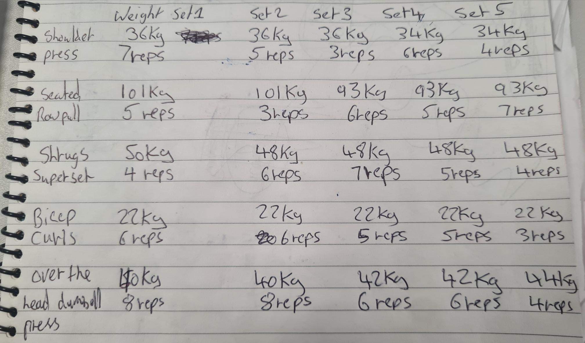


<p>As you can see in the images above when logging the exercises on pen and paper it is time consuming manually writing each exercise and it's details, alongside that it is missing relevant information such as date and the ability to write more information such as comments for each exercise as I try to keep it concise on the paper. The inability to search for a specific exercise with a certain date or the inability to view the same exercises on various dates lacks a view of progression to the user. These inabilities that I have mentioned are providing issues to me when trying to gauge the progress that I am making at the gym, the application that I have built works round these problems and allows me to see a better view of my progress in the gym.</p>

<h2>System Overview</h2><hr>
<p> The application that I created was built with a MVC (Model, View, Controller) architecture in mind, I used Node.js for the back end to connect my application to MongoDB which I used as a cloud database solution that was holding the data for this application which was the individual exercises and the users that would sign-up and login onto the application. For the front end views I used EJS and Bootstrap to create my views for my application. </p>

<p>Within my application I have two database collections which are exercises and users.</p>

<p>My application has 4 key folders</p>
<li>Controllers which has my exercise and user controllers which communicate with their respective models. Alongside that has an API folder which has a function inside of it which is useful for searching exercises</li>
<li>Models folder which holds the schemas for my database collections User and Exercise</li>
<li>Views folder which holds all my front end web pages </li>
<li>Public folder which has some basic images for my application, also their is a scripts folder inside public which has an important script that is used to allow functionality for a user to search for an exercise.</li>

<h3>Controllers</h3><hr>

<p> The role of the controller in an MVC architecture is responsible for communicating with the model and the view layers within a MVC architecture. In my application the controller is used to communicate with the model to retrieve specific data, which then passes that data to the view layer to render the specific action back to the user(Vikramsaha7,2022).</p>

<h5> User Controller</h5> <hr>
<p>My user controller that I have implemented is used to handle user authentication in two ways. One function allows a new user to sign up to my application and the other function handles authentication by allowing the user to login in to my application. </p>


```javascript
const User = require('../models/User');
const bcrypt = require('bcrypt');

exports.create = async (req, res) => {
    try {

        const user = new User({ email: req.body.email, password: req.body.password });
        await user.save();
        res.redirect('/home')
    } catch (e) {
        if (e.errors) {
            console.log(e.errors);
            res.render('sign-up', { errors: e.errors })
            return;
        }
        return res.status(400).send({
            message: JSON.parse(e),
        });
    }
```

    
<p> Function from user controller which creates a new user and allows a user to sign up to my application.</p>

```javascript
exports.login = async (req, res) => {
    try {
        const user = await User.findOne({ email: req.body.email });
        if (!user) {
            res.render('login-user', { errors: { email: { message: 'email not found' } } })
            return;
        }

        const match = await bcrypt.compare(req.body.password, user.password);
        
        if (match) {
            req.session.userID = user._id;
            res.redirect('/home')
            console.log(req.session.userID);
            return
        }

        res.render('login-user', { errors: { password: { message: 'password does not match' } } })


    } catch (e) {
        return res.status(400).send({
            message: JSON.parse(e),
        });
    }
}
```

<p>Function that handles user authentication and allows the user to login. Within the function there is validation that is passed back to the user if there is no email found or if there is no match with the email and password. If the login is successful then the user is then redirected to the home page.

<h5> Exercise Controller</h5> <hr>
<p>The exercise controller that I have implemented is used to communicate with the exercise model to retrieve specific data depending on the user's action.</p>


```javascript
const Exercise = require("../models/Exercise");
const { db } = require("../models/User");

exports.create = async (req, res) => {
    try{
        let exercise =  new Exercise(
            {date: req.body.date, 
            exerciseName: req.body.exerciseName, 
            weight: req.body.weight, 
            setAndReps: req.body.setAndReps, 
            comments: req.body.comments,
            user: req.session.userID,});
        await exercise.save();
        res.redirect(`view-exercise/?message=New Exercise: ${req.body.exerciseName} with Date: ${req.body.date} has been created`)
    }catch(e){
        if(e.errors) {
            console.log(e.errors);
            res.render('create-exercise', { errors: e.errors});
            return;
        }
        return res.status(400).send({
            message: JSON.parse(e),
        });
    }
}
```

<p>This function here communicates to the exercise model to create a new exercise record within the database. If successful redirects the user back to the view-exercise page and displays a success message.</p>

```javascript
exports.lists = async (req, res) => {
    try{
        const message = req.query.message;
        const exercises = await Exercise.find({user: req.session.userID});
        res.render("view-exercise", {exercises, message: req.query?.message});
    } catch(e){
        res.status(404).send({message: "could not find exercise"})
    }
}
```

<p>This function communicates with the exercise model to get all the exercises that is associated with the logged in user. When the exercises are found it renders and passes the exercises found to the view layer page view-exercise. The view-exercise page then handles how it displays that information to the user.</p>

```javascript
exports.delete = async (req, res) => {
    const id = req.params.id;
    try{
        await Exercise.findByIdAndDelete(id);
        res.redirect(`/view-exercise/?message= Exercise has been sucessfully deleted`);
    } catch(e){
        res.status(404).send({message: "could not delete exercise"})
    }
}
```

<p>This function communicates to the exercise model to find an exercise by it's unique id and then deletes it, if successful then a success message is presented to the user.</p>


```javascript
exports.edit = async (req, res) => {
    const id = req.params.id;
    try{
        const exercise = await Exercise.findById(id);
        res.render("update-exercise", {exercise: exercise, id: id, errors: {} });
    } catch(e){
        if(e.errors){
            console.log(e.errors);
            return res.render('update-exercise', {errors: e.errors });
        }
        res.status(404).send({
            message: `could not find exercise ${id}.`,
        });
    }
}

exports.update = async (req, res) => {
    const id = req.params.id;
    try{
        const exercise = await Exercise.updateOne({ _id: id }, req.body, {runValidators:true});
        res.redirect(`/view-exercise/?message= Exercise: ${req.body.exerciseName} with Date: ${req.body.date} has been sucessfully updated`);
    }catch(e){
        if(e.errors){
            return res.render('update-exercise', {errors: e.errors, exercise:req.body});
        }
        res.status(404).send({
            message: `could not update exercise ${id}.`,
        });
    }
}
```

<p>These 2 functions communicate to the exercise model to edit and update those edits to the specific exercise.</p>

```javascript
exports.last7DaysExercises = async (req, res) => {
    try {
        const sevenDaysAgo = new Date(Date.now() - 7 * 24 * 60 * 60 * 1000);
        const exercises = await Exercise.find({
            user: req.session.userID,
            date: { $gte: sevenDaysAgo }
        }).sort({ date: -1 }).limit(10);
        res.render("home", { exercises });
    } catch (e) {
        res.status(404).send({ message: "could not find exercise" });
    }
};
```


<p>This function here works similar to the lists function that was previously mentioned, but this function communicates with the exercise model to retrieve exercises that have a date within the last 7 days. It retrieves and renders the information and passes it to the home page. 

<h5> API Controllers</h5> <hr>

```javascript
const Exercise = require('../../models/Exercise');

exports.list = async (req, res ) => {
    const searchQuery = req.query.search;

    if (!searchQuery) {
        res.json([]);
    }

    try{
        const Result = await Exercise.find({
            $text: {$search: searchQuery},
            user: req.session.userID,
        });
        if (!Result.length) {
            res.render('view-exercise', {
                message: 'No results found'
            });
            return;
        }
        res.json(Result);
    } catch(error){
        console.log(error);
        res.status(404).send({
            message: `could not perform search`
        });
    }
}
```
<p>This API function that I created allows the user to search for specific exercises that are associated with the user. </p>

<h4>Key View and interfaces</h4><hr>

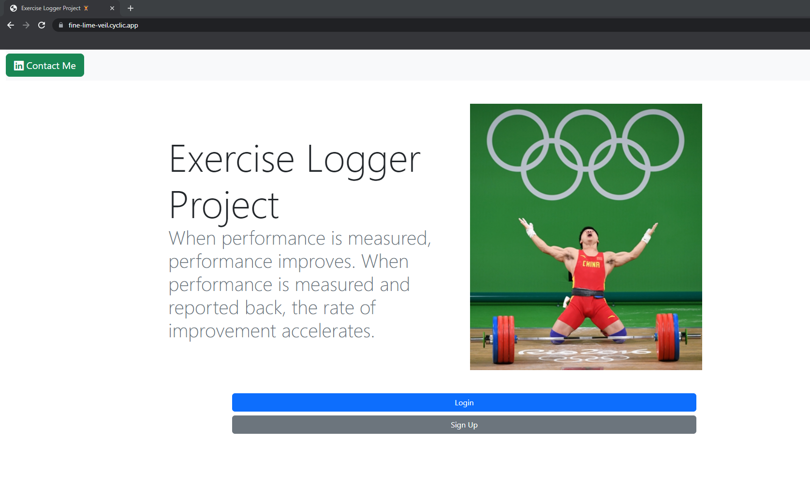
<p>When the user goes to my hosted application they will be presented with this index page. From there the user has the option to sign up or login onto the application. 

```javascript
//________ Locking non logged in from users from  accessing the various pages____________________


app.get("/create-exercise", authMiddleware, (req, res) => {
  res.render("create-exercise", { errors: {} });
});


app.get("/edit-exercise", authMiddleware, (req, res) => {
  res.render("edit-exercise", { errors: {} });
});

app.get("/edit-success", authMiddleware, (req, res) => {
  res.render("edit-success", { errors: {} });
});

app.get("/delete-success", authMiddleware, (req, res) => {
  res.render("delete-success", { errors: {} });
});

app.get("/search-exercises", authMiddleware, (req, res) => {
  res.render("search-exercises", { errors: {} });
});

//_______________________End of locking out of non logged in users ____________________________
```

<p>The user must be logged in to be able to do CRUD operations on the application. This image shows all the routes that are protected and locked down, which forces the user to be logged in to be able to get to these pages. This is critical that a user must be logged in when creating an exercise as there is a relationship association between an exercise and a user.

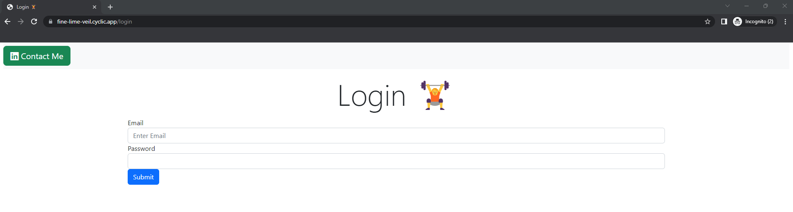
<p>Login Page</p>

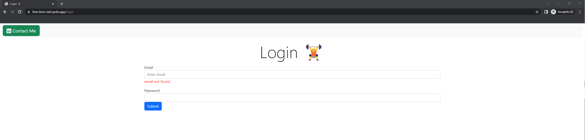
<p>Error validation in place if a user tries to login with an email that hasn't been registered onto the application</p>

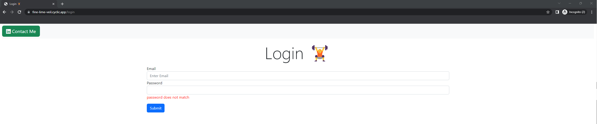
<p>Error validation in place if a user inputs an incorrect password with a registered email.


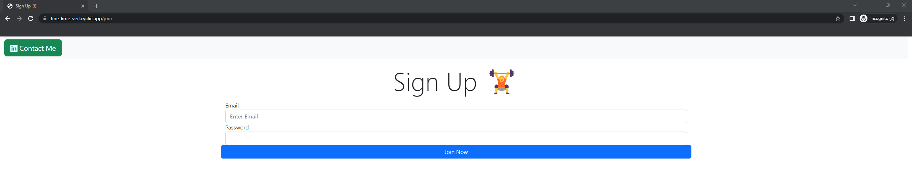
<p>Sign up page allowing a user to register an email and a password onto the application.</p>

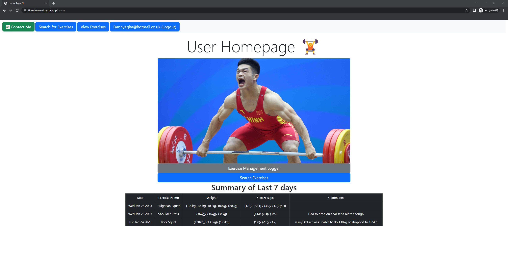
<p> Once the user has logged in successfully they will be redirect to this homepage. From there they can search exercises, view exercises and logout. This page utilities the last7DayExercises function to showcase a recent summary of the last 7 days worth of exercises.

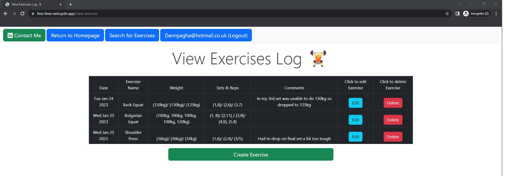
<p> The view-exercise is a very important page in that from this page the user is able to do all the CRUD operations within this page. The user can see all exercises that they have created on the application, they also have the ability to create  exercises, edit current exercises or delete exercises.

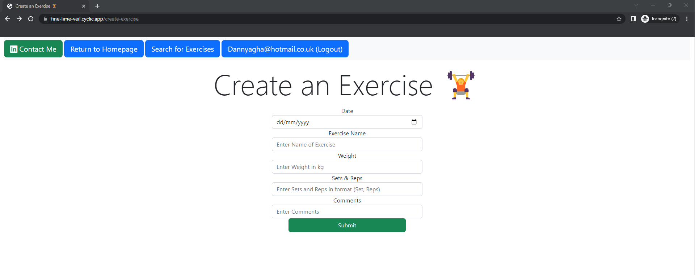
<p>Create exercise page</p>

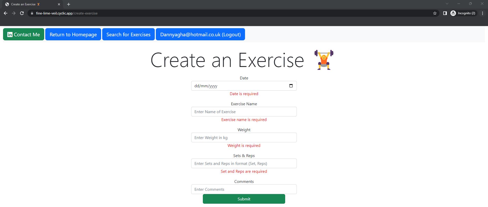
<p>In this image I have implemented error validation that will alert the user if they are missing required information when creating an exercise.</p>

```javascript
const mongoose = require("mongoose");
const { Schema } =  mongoose;

const exerciseSchema = new Schema(
    {
        date:{type:Date, required:[true, 'Date is required']},
        exerciseName:{type:String, required:[true, 'Exercise name is required']},
        weight:{type:String, required:[true, 'Weight is required']},
        setAndReps:{type:String, required:[true, 'Set and Reps are required']},

        // I have ommitted comments since I want it to be an optional input for the user.
        comments:{type:String},
        user: { type: Schema.Types.ObjectId, ref: 'User', required:true}
    }
)

exerciseSchema.index({'$**': 'text'});
module.exports = mongoose.model("Exercise", exerciseSchema);
```

<p>As you can see in the exercise schema the only attribute that is optional when creating an exercise is comments everything else excluding the user in the form is required when creating an exercise.</p>

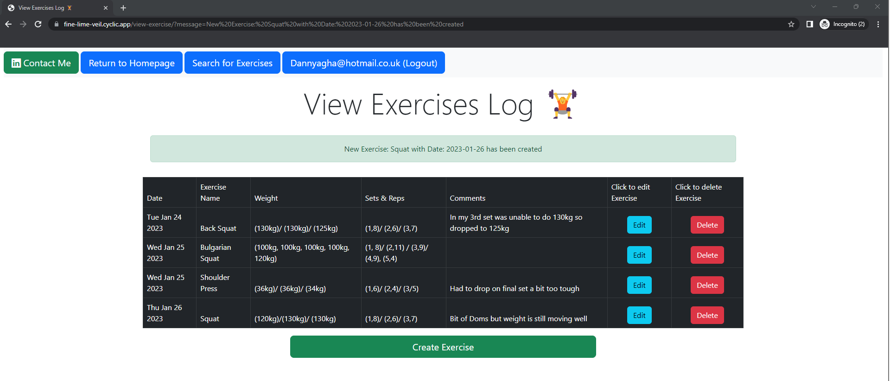
<p>Image of a successful creation of an exercise log where a success message is displayed to the user.</p>

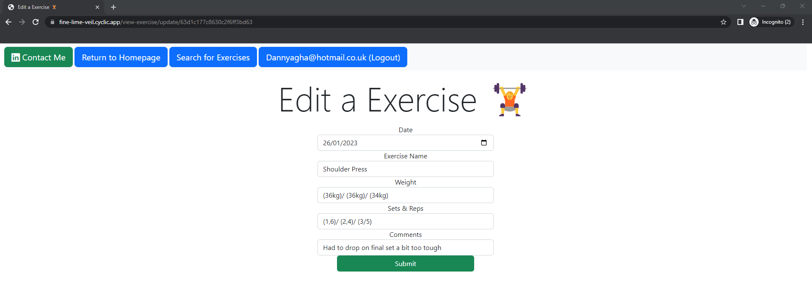
<p>Edit exercise page</p>

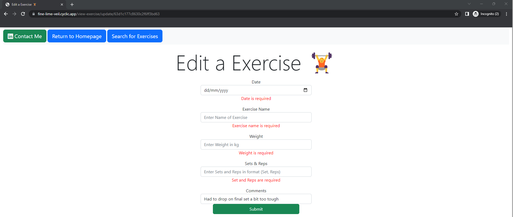
<p>In this image I have implemented error validation for editing as well, same with create an exercise if there are any required fields that are missing the application will alert the user if any required information is missing</p>

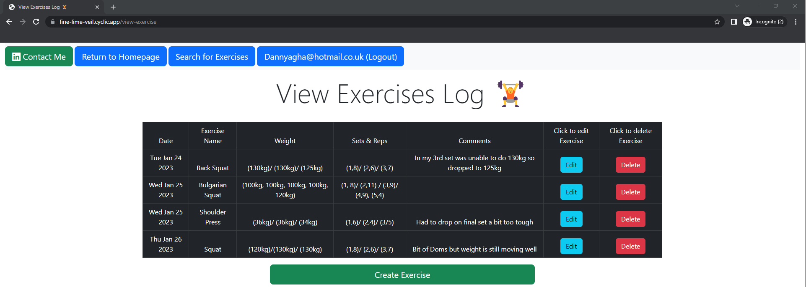
<p>Before edit(Shoulder Press)</p>

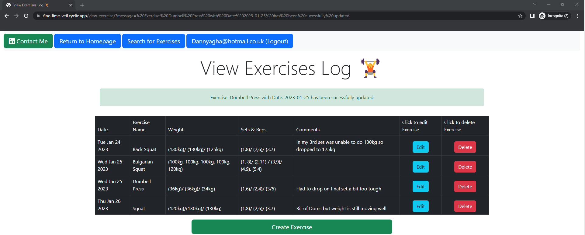
<p>Successful edit (Shoulder Press -----> Dumbbell press) </p>

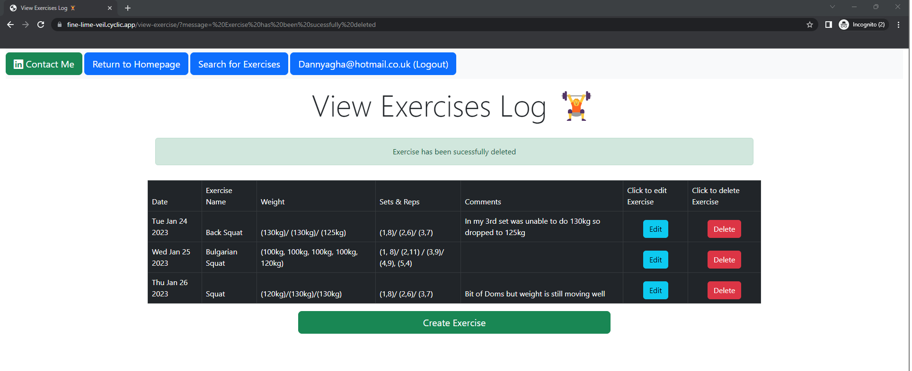
<p>Successfully deleting Dumbbell Press exercise.

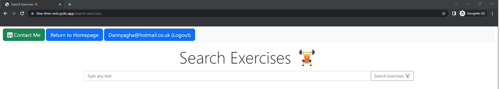
<p>Search functionality allowing the user to search for an exercise that they created.</p>

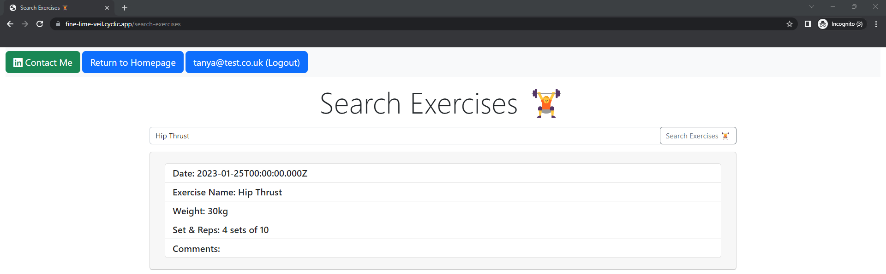
<p>Search functionality successfully returning an exercise that is associated with the user.

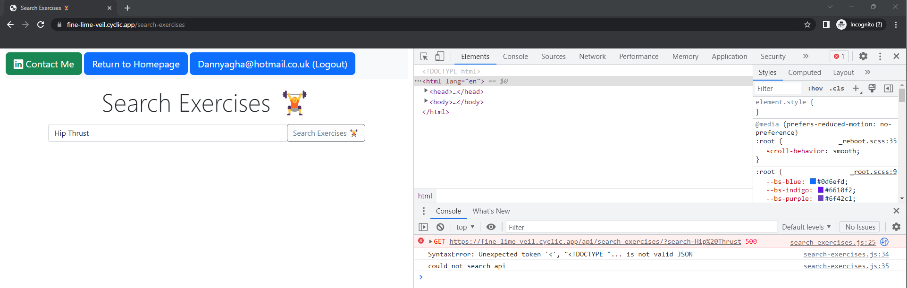
<p>One key functionality I was able to successfully implement through the use of good database relationship, in this image I have a different user where the exercise "Hip Thrust" is not associated with the user, that user is only allowed to search for exercises that are associated with that user. As you can see the application is returning an error when the user tries to search for an exercise that is not associated with that user. </p>

<h2>Key Design Decisions</h2><hr>
<p>The whole application as previously mentioned has a database that is stored on a cloud solution called MongoDB and within that database has 2 collections "users" and "exercises".</p>

<h4>Users Collection</h4>

<p>The users collection stores information about each user and it is utilised within the user authentication. Each user has an Email and Password. </p>

```javascript
const userSchema = new Schema(
    {
        email: { type: String, required: [true, 'email is required'], unique: true },
        password: { type: String, required: [true, 'password is required'] },
    },
    { timestamps: true }
);
```
<p>User collection schema</p>

```javascript
{
  "_id": {
    "$oid": "63d1820e5c0b71249c89f084"
  },
  "email": "Dannyagha@hotmail.co.uk",
  "password": "$2b$10$.NjMfB9T46/hccJUo.wZmuAgTT39zK6EqthpmmC0XGeLYCTZwNQG.",
  "createdAt": {
    "$date": "2023-01-25T19:25:02.306Z"
  },
  "updatedAt": {
    "$date": "2023-01-25T19:25:02.306Z"
  },
  "__v": 0
}
```
<p>Example of a document from the user collection</p>

<h4>Exercises Collection</h4>
<p>The exercise collection stores information about a single exercise that is created by a user. Also an exercise has a relationship with a user/user_id. For security purposes the password is stored in hashed value.</p>

```javascript
const mongoose = require("mongoose");
const { Schema } =  mongoose;

const exerciseSchema = new Schema(
    {
        date:{type:Date, required:[true, 'Date is required']},
        exerciseName:{type:String, required:[true, 'Exercise name is required']},
        weight:{type:String, required:[true, 'Weight is required']},
        setAndReps:{type:String, required:[true, 'Set and Reps are required']},

        // I have ommitted comments since I want it to be an optional input for the user.
        comments:{type:String},
        user: { type: Schema.Types.ObjectId, ref: 'User', required:true}
    }
)

exerciseSchema.index({'$**': 'text'});
module.exports = mongoose.model("Exercise", exerciseSchema);
```
<p>As you can see in the last line of the schema I make a reference to a userID.This mean every exercise created will have a relationship to a user. Some key things to note from this schema is that the create and edit error validation for missing information is only vital because of the attributes that have the keyword "true:" followed by the message.If that specific information is missing when creating or editing an exercise than that specific message will be shown for the missing attribute.</p>

```javascript
{
  "_id": {
    "$oid": "63d189082eca8e10c3e09d22"
  },
  "date": {
    "$date": "2023-01-24T00:00:00Z"
  },
  "exerciseName": "Back Squat",
  "weight": "(130kg)/ (130kg)/ (125kg)",
  "setAndReps": "(1,8)/ (2,6)/ (3,7)",
  "comments": "In my 3rd set was unable to do 130kg so dropped to 125kg",
  "user": {
    "$oid": "63d1820e5c0b71249c89f084"
  },
  "__v": 0
}
```
<p>Here is an example of a document from the exercise collections as you can see with the user attribute there is a objectID referenced with that user attribute which is the userID that created that exercise.</p>

<p>As you can see with the two collection schemas that I created I was able to structure a relationship between the two collections. This is because when analysing and designing the database, I wanted to create a relationship where a user has many exercises associated to them in a one(User) to many(exercises) relationship.</p>

<p>The relationship that I created was vital for my application to work effectively as this associated an exercise to a user, this functionality made it so that a user on my application would only be able to do CRUD and search operations for exercises that were associated with that user. The relationship association also locked the users from accessing or altering other users exercise data which is another reason why this relationship was vital to implement.</p>

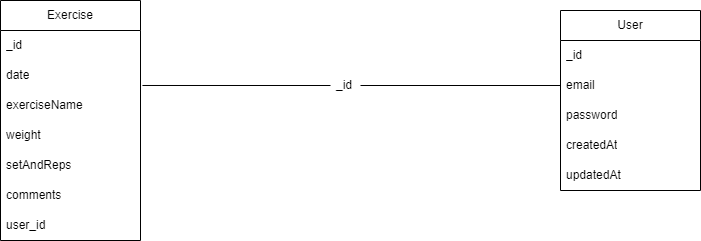

<p>In this entity relationship diagram that I created you can see the two collections, the collections attributes and how they relate to each other. The image illustrates the relationship as it shows the user_id being connected to the exercise to form the relationship and thus associating an exercise object to a user. Bare in mind that the database technology that I have chosen is a non-relational database, but this class diagram that I created showcases how the attributes are associated to create the vital relationship that I have implemented into my application.</p>

<h4>Security and Scalability</h4><hr>
<p>One key implementation that I made for ensuring security for my users is securing their private passwords in a secure manner. In order to reduce the risk of outside malicious interaction, I have made sure to store the user's password in a hashed format and not plain text through the use BCrypt. BCrypt is a slow algorithm which is good for security as this forces a long amount of time for a malicious outsider to brute force a users password on my application. As this application is only a proof of concept it is open to updates and further improvements, one improvement would be to utilise a third party authentication service that is used quite allot by the public such as facebook,google mail or appleID. This improvement would streamline single signup/on, allowing the user an easier alternative to signing up and logging into the application.</p>

<p>Through testing with myself and friends I was able to attain that my application and it's various aspects such as UI and the database communication is very scaleable. With the use of MongoDB as my cloud database this helps with scalability as I can rely on a cloud database never faulting when handling large amounts of data compared to a physical database.</p>

<h2>Conclusion and Reflection</h2><hr>

<p>In conclusion I have been able to implement CRUD operations in my application to a high standard where error validation is implemented for both create and edit forcing the users to be policed when inserting or updating data. User authentication works amazingly when signing up and logging in and the relationship between a user and exercises works effectively as a security purpose as users are only able to search for exercises that are associated with them. The use of API to search for specific exercise logs that I implemented is a big positive as users can search for specific exercise logs and compare the progress within that exercise. Finally for the views I loved playing around with Bootstrap and making some clean designs for my views on my application and I really think I made some great clean views on my application without the use of bootstrap templates.</p>

<p>The application is only a proof of concept, but going forward I would look at implementing a way of allowing users to upload videos, this would give more detail and imagery to raw data for the user. I would also look at improving some of the views, even though I believe my views are polished and clean, there are some areas where I could look at improving to make the design part of my application better. </p>


<h2>References</h2><hr>

<li>Vikramsaha7, 2022, MVC Framework Introduction[Viewed on 26th January 2023], Available from: https://www.geeksforgeeks.org/mvc-framework-introduction/ </li>

<h2>Appendices</h2><hr>

<h4>Issues with Cyclic hosting</h4>

<p>When it came to hosting the application onto the recommended hosting platform which was Cyclic there were a couple of issues that I ran into from the local version of my application compared to hosted application on Cylic.</p>

<p>An issue when it came to cylic deployment is how it handled new user sessions. When a new user signs up their user session variable is never read on first instance, the user is forced to log out first and then log back in with their newly created login details for the application to read the user's session variable. As all the CRUD operations were protected and not accessible for non logged in users to protect the data on the database. Cylic having issues with reading the user session variables on first sign up forced users to log out and log back in, so that the user session variable can be read so that the user can do CRUD and search operations on my application.</p>

<p> Another issue with Cylic is that I had to sometimes check if my application was running or not since sometimes during the day it was down and I would have to go into cylic to redeploy it to get it hosted and working again.</p>

<p>In the next iteration of my application I will look for an alternative in regards to a hosting provider so these issues don't crop up again. </p>


