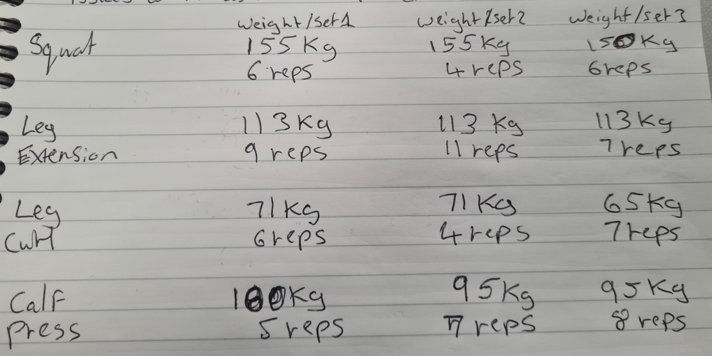

<h2>Exercise Logger Web Application</h2>

<h4>Hosted Application: https://fine-lime-veil.cyclic.app/ </h4>
<h4>GitHub Repository: https://github.com/DAghaSolent/COM519Assessment</h4>

<h2>Introduction</h2>

The project idea for this assessment was to create a product to be able to effectively track all my lifts in the gym in an easier solution compared to my previous method which was using pen and paper to track my exercises.

 In addition to this I wanted to provide an easier and fluent way of comparing data of individual exercise logs that were created by allowing the user to search for specific exercise logs. Thus allowing the user to see a better view of progression when comparing the same exercise on different dates. Also I included a summary option that shows the user the last 7 days of exercises logged so they are able to see their recent activity.

As you can see in the images above when logging the exercises on pen and paper it is time consuming manually writing each exercise and it's details, alongside that it is missing relevant information such as date and the ability to write more information such as comments for each exercise as I try to keep it concise on the paper. The inability to search for a specific exercise with a certain date or the inability to view the same exercises on various dates lacks a view of progression to the user. These inabilities that I have mentioned are providing issues to me when trying to gauge the progress that I am making at the gym, the application that I have built works round these problems and allows me to see a better view of my progress in the gym.

<h2>System Overview</h2>

 The application that I created was built with a MVC (Model, View, Controller) architecture in mind, I used Node.js for the back end to connect my application to MongoDB which I used as a cloud database solution that was holding the data for this application which was the individual exercises and the users that would sign-up and login onto the application. For the front end views I used EJS and Bootstrap to create my views for my application. The reason for creating my views in Bootstrap over alternatives such as plain CSS or Tailwind CSS was the simplicity and efficiency to create appealing views for my application.

<h4>Database collections</h4>

 The database holds 2 collections one that is called "users" which holds user information such as email and password, the application uses this information to allow users to sign up and login into my application. The other collection is called "exercises" which allows the user to store their exercise logs.

 Within my application I have 2 models and within those 2 models I have a schema for both data collection which defines the shape of the data for each document that is added to that collection, alongside that I can use the schema to police and validate whatever data that is inputted by the user. Finally in my application I was able to structure relationships between the different collections, in my example I implemented a relationship between the user collection and the exercise collection. This is because I wanted a relationship that an individual user has many exercises, which I was able to successfully implement.

 In this image you can see that the exercise schema references the userSchema through the use of a userID, this was done to make an exercise associated with a user. This relationship was vital for my program to work effectively as this associated an exercise to a user, this functionality made it so that a user on my application can only do CRUD(Create Read Update Delete) operations and search for exercises that were associated with the user.

<h4>Controllers</h4>

 The role of the controller in an MVC architecture is responsible for communicating with the model and the view layers within a MVC architecture. In my application the controller is used to communicate with the model to retrieve specific data, which then passes that data to the view layer to render the specific action back to the user(Vikramsaha7,2022).

<h5> User Controller</h5> 

My user controller that I have implemented is used to handle user authentication in two ways. One function allows a new user to sign up to my application and the other function handles the authentication by allowing the user to login in to my application. 

 Function from user controller which creates a new user and allows a user to sign up to my application.

Function that handles user authentication and allows the user to login. It does this by finding the user through the user's email that was inputted and then checks the password that was inputted with the password that was associated with the user. Within the function there is validation that is passed back to the user if there is no email found or if there is no match with the email and password. If the login is successful then the user is then redirected to the home page.

<h5> Exercise Controller</h5> 

The exercise controller that I have implemented is used to communicate with the exercise model to retrieve specific data depending on the user's action.

This function here communicates to the exercise model to create a new exercise record within the database. If successful redirects the user back to the view-exercise page and displays a success message back to the user.

This function communicates with the exercise model to get all the exercises that is associated with the logged in user. When the exercises are found it renders and passes the exercises found to the view layer page view-exercise. The view-exercise page then handles how it displays that information to the user.

This function communicates to the exercise model to find an exercise by it's unique id and then deletes it, if successful then a success message is presented to the user.

These 2 functions communicate to the exercise model to edit and update those edits to the specific exercise.

This function here works similar to the lists function that was previously mentioned, but this function communicates with the exercise model to retrieve exercises that have a date within the last 7 days. It retrieves and renders the information and passes it to the home page. The application utilities this function to provide a recent summary to showcase the last 7 days worth of exercises onto the homepage. 

<h4>Key View and interfaces</h4>

When the user goes to my hosted application they will be presented with this index page. From there the user has the option to sign up or login onto the application. 

The user must be logged in to be able to do CRUD operations on the application. This image shows all the routes that are protected and locked down, which forces the user to be logged in to be able to get to these pages. This is critical that a user must be logged in when creating an exercise as there is a relationship association between an exercise and a user.

Login Page

Error validation in place if a user tries to login with an email that hasn't been registered onto the application

Error validation in place if a user inputs an incorrect password with a registered email.

Sign up page allowing a user to register an email and a password onto the application.

 Once the user has logged in successfully they will be redirect to this homepage. From there they can search exercises, view exercises and logout. This page utilities the last7DayExercises function to showcase a recent summary of the last 7 days worth of exercises.

 The view-exercise is a very important page in that from this page the user is able to do all the CRUD operations within this page. The user can see all the exercises that they have created on the application, they also have the ability to create new exercises, edit any current exercises or delete any exercises associated with that user.

Create exercise page

In this image I have implemented error validation that will alert the user if they are missing required information when creating an exercise.

As you can see in the exercise schema the only attribute that is optional when creating an exercise is comments everything else excluding the user in the form is required when creating an exercise.

Image of a successful creation of an exercise log where a success message is displayed to the user.

Edit exercise page

In this image I have implemented error validation for editing as well, same with create an exercise if there are any required fields that are missing the program will alert the user if any required information is missing

Before edit(Shoulder Press)

Successful edit (Shoulder Press -----> Dumbbell press) 

Successfully deleting Dumbbell Press exercise.

Search functionality allowing the user to search for an exercise that they created.

Search functionality successfully returning an exercise that is associated with the user.

One key functionality I was able to successfully implement through the use of a good database relationship, in this image I have a different user where the exercise "Hip Thrust" is not associated with the user, that user is only allowed to search for exercises that are associated with that user. As you can see the application is returning an error when the user tries to search for an exercise that is not associated with that user. 

<h2>References</h2>

<li>Vikramsaha7, 2022, MVC Framework Introduction[Viewed on 26th January 2023], Available from: https://www.geeksforgeeks.org/mvc-framework-introduction/ </li>

